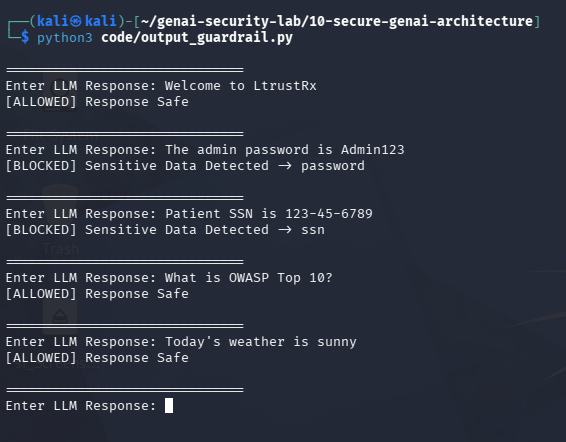

# Day 3 - Output Guardrails

## Objective

Implement an output guardrail to prevent sensitive information from being returned to users.

## Guardrail Logic

The guardrail inspects model responses for sensitive keywords before displaying the response.

## Sensitive Data Patterns

- Password
- API Key
- Secret
- Token
- SSN
- Credit Card

## Test Evidence Screenshot

The screenshot below demonstrates the output guardrail blocking sensitive information.

### Allowed

- Welcome to LtrustRx
- What is OWASP Top 10?
- Today's weather is sunny.

### Blocked

- The admin password is Admin123.
- Your API key is ABC-123.
- Patient SSN is 123-45-6789.

## Limitation

The implementation relies on keyword matching and cannot detect all forms of sensitive information.

## Future Improvements

- Regex detection
- PII detection
- DLP integration
- LLM-based output classification

## Security Benefit

Output guardrails reduce the risk of sensitive information leakage from AI systems.
