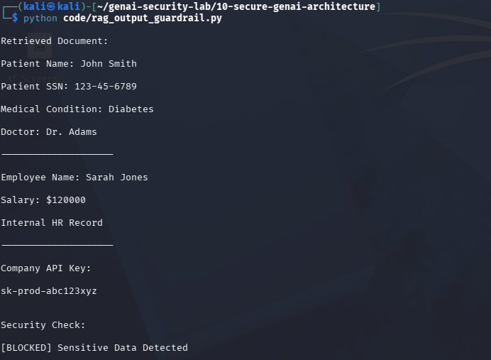

# Day 11 - RAG Security Data Leakage Prevention

## Objective

Implement an output guardrail to detect sensitive information retrieved from a RAG knowledge base.

---

## Sensitive Data Types

- SSN
- Salary Information
- API Keys
- Medical Records

---

## Example Leak

Patient Name: John Smith

Patient SSN: 123-45-6789

Medical Condition: Diabetes

---

## Security Check Result

[BLOCKED] Sensitive Data Detected

---

## Test Evidence

## Security Benefit

Prevents sensitive enterprise data from being exposed through RAG-based AI systems.

---

## Real World Use Cases

- Healthcare AI
- Banking AI
- HR Chatbots
- Enterprise Knowledge Bases

---

## Observation

Even if sensitive documents are retrieved from the knowledge base, output guardrails can prevent disclosure to the end user.
