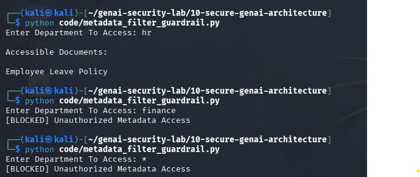

# Day 13 - Metadata Filter Bypass Protection

## Objective

Implement metadata-based access control for RAG systems.

## Threat

Attackers may attempt to access documents belonging to other departments by manipulating metadata filters.

## Example

User Department:

HR

Requested Department:

Finance

Result:

[BLOCKED] Unauthorized Metadata Access

## Test Evidence

## Security Benefit

Prevents unauthorized retrieval of documents from other departments.

## Real World Impact

Metadata filtering is commonly used in:

- Healthcare AI
- Enterprise Knowledge Bases
- Banking AI
- Internal Chatbots

Weak metadata controls can lead to sensitive information disclosure.
