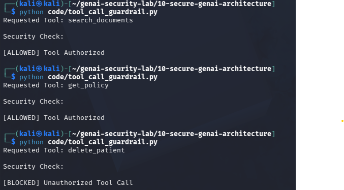

# Day 15 - Tool Calling Security

## Objective

Implement authorization checks before executing AI tool calls.

## Threat

AI agents may attempt to execute sensitive tools if proper authorization controls are not implemented.

## Example

Requested Tool:

delete_patient

Result:

[BLOCKED] Unauthorized Tool Call

## Test Evidence

## Security Benefit

Prevents execution of dangerous or unauthorized tools.

## Real World Impact

Tool calling security is essential for:

- OpenAI Agents
- MCP Servers
- Enterprise AI Assistants
- Healthcare AI
- Banking AI

Unauthorized tool execution may result in data loss, privilege escalation, or system compromise.
