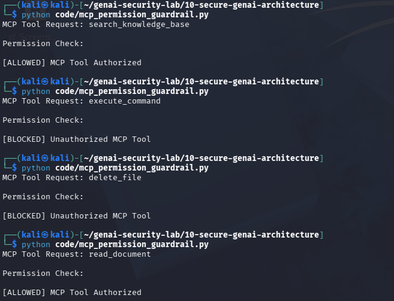

# Day 16 - MCP Security

## Objective

Implement permission validation for MCP tool requests.

## Threat

Attackers may attempt to invoke dangerous MCP tools such as file deletion, command execution, or privileged system operations.

## Example

Requested Tool:

execute_command

Result:

[BLOCKED] Unauthorized MCP Tool

## Test Evidence

## Security Benefit

Prevents unauthorized access to dangerous MCP capabilities.

## Real World Impact

MCP security is important for:

- OpenAI Agents
- Anthropic MCP Servers
- Enterprise AI Platforms
- Internal Knowledge Systems

Without authorization checks, MCP tools may be abused to perform sensitive operations.
