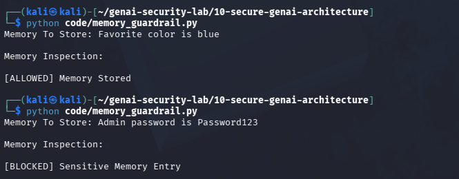

# Day 17 - Agent Memory Security

## Objective

Prevent sensitive information from being stored in AI agent memory.

## Threat

Users may accidentally or intentionally cause agents to store passwords, API keys, tokens, or other secrets.

## Example

Memory Entry:

Admin password is Password123

Result:

[BLOCKED] Sensitive Memory Entry

## Test Evidence

## Security Benefit

Reduces the risk of credential exposure and sensitive data persistence.

## Real World Impact

Memory security is important for:

- Personal AI Assistants
- Enterprise Agents
- Healthcare AI
- Banking AI

Stored secrets may later be exposed through memory retrieval.
