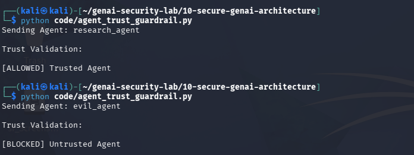

# Day 19 - Multi-Agent Security

## Objective

Validate trust between communicating AI agents.

## Threat

Untrusted or compromised agents may attempt to influence trusted agents.

## Example

Sending Agent:

evil_agent

Result:

[BLOCKED] Untrusted Agent

## Test Evidence

## Security Benefit

Prevents unauthorized agent communication.

## Real World Impact

Important for:

- CrewAI
- AutoGen
- LangGraph
- Enterprise Agent Systems

Trust validation helps reduce lateral movement between agents.
