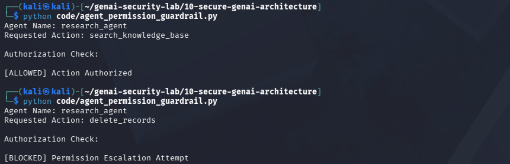

# Day 20 - Agent Permission Escalation

## Objective

Prevent agents from performing actions outside their authorized permissions.

## Threat

A compromised or malicious agent may attempt to execute privileged actions.

## Example

Agent:

research_agent

Requested Action:

delete_records

Result:

[BLOCKED] Permission Escalation Attempt

## Test Evidence

## Security Benefit

Prevents unauthorized access to privileged capabilities.

## Real World Impact

Important for:

- Multi-Agent Systems
- OpenAI Agents
- CrewAI
- AutoGen
- Enterprise AI Platforms

Role-based authorization reduces the risk of privilege escalation.
