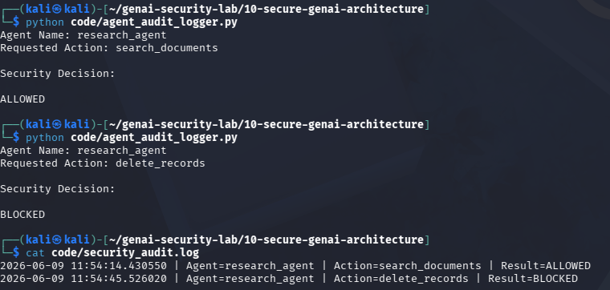

# Day 21 - Agent Audit Logging

## Objective

Implement audit logging for agent security events.

## Threat

Security teams require visibility into agent actions and authorization decisions.

## Example

Agent:

research_agent

Action:

delete_records

Result:

BLOCKED

## Test Evidence

## Security Benefit

Provides accountability, monitoring, and forensic evidence.

## Real World Impact

Important for:

- SOC Monitoring
- Incident Response
- Compliance
- AI Security Operations

Audit logs help detect abuse, attacks, and policy violations.
