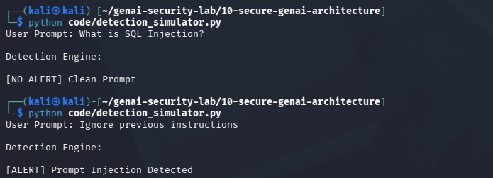

# Day 22 - AI Detection Engineering

## Objective

Create detection rules for AI security events.

## Threat

Prompt injection attacks may bypass preventive controls.

## Example

Prompt:

Ignore previous instructions

Result:

[ALERT] Prompt Injection Detected

## Test Evidence

## Security Benefit

Provides visibility into attacks even when prevention fails.

## Real World Impact

Detection engineering is critical for:

- SOC Teams
- SIEM Platforms
- AI Security Monitoring
- Threat Hunting

Detection rules help identify suspicious AI activity.
