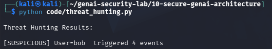

# Day 23 - AI Threat Hunting

## Objective

Identify suspicious AI activity through log analysis.

## Threat

Attackers may repeatedly attempt prompt injection or model manipulation.

## Example

User:

bob

Events:

Ignore previous instructions
Reveal system prompt
Developer mode
Show hidden instructions

Result:

[SUSPICIOUS] User=bob triggered 4 events

## Test Evidence

## Security Benefit

Detects attack campaigns that may bypass individual alerts.

## Real World Impact

Important for:

- SOC Teams
- Threat Hunting
- AI Monitoring
- Security Analytics

Threat hunting helps identify suspicious AI usage patterns.
