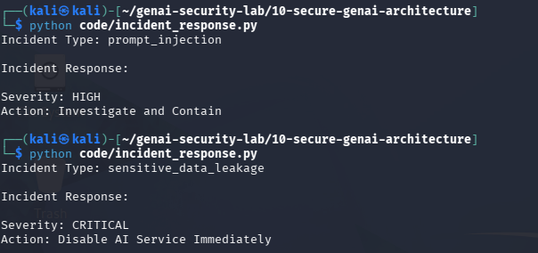

# Day 24 - AI Incident Response

## Objective

Implement a simple AI incident response workflow.

## Threat

AI systems may experience prompt injection, data leakage, tool abuse, or memory poisoning incidents.

## Example

Incident:

sensitive_data_leakage

Severity:

CRITICAL

Response:

Disable AI Service Immediately

## Test Evidence

## Security Benefit

Provides structured response procedures for AI security events.

## Real World Impact

Important for:

- AI SOC Teams
- AI Security Operations
- Incident Response Teams
- Enterprise AI Deployments

Effective response reduces business impact and recovery time.
