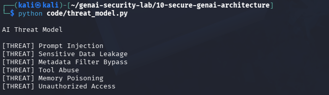

# Day 25 - AI Threat Modeling

## Objective

Identify security threats before deploying AI systems.

## Example System

RAG Chatbot

## Threats Identified

- Prompt Injection
- Sensitive Data Leakage
- Metadata Filter Bypass
- Tool Abuse
- Memory Poisoning
- Unauthorized Access

## Test Evidence

## Security Benefit

Threat modeling helps identify risks early and design appropriate controls.

## Real World Impact

Used by:

- Security Architects
- AI Security Engineers
- Product Security Teams
- Enterprise AI Programs

Threat modeling reduces security risks before deployment.
