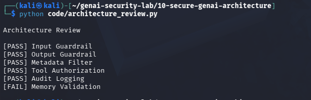

# Day 26 - Secure Architecture Review

## Objective

Review AI architecture and verify security controls.

## Controls Evaluated

- Input Guardrails
- Output Guardrails
- Metadata Filters
- Tool Authorization
- Audit Logging
- Memory Validation

## Test Evidence

## Example Finding

Memory Validation

Status:

FAIL

## Security Benefit

Architecture reviews identify missing controls before production deployment.

## Real World Impact

Used by:

- Security Architects
- AI Security Engineers
- Product Security Teams
- AI Consultants

Architecture reviews reduce deployment risk and improve security posture.
