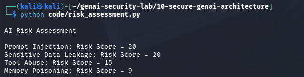

# Day 27 - AI Risk Assessment

## Objective

Assess AI security threats based on likelihood and impact.

## Formula

Risk Score = Likelihood × Impact

## Example Results

Prompt Injection = 20

Sensitive Data Leakage = 20

Tool Abuse = 15

Memory Poisoning = 9

## Test Evidence

## Security Benefit

Risk assessments help prioritize remediation efforts.

## Real World Impact

Used by:

- Security Architects
- AI Security Engineers
- CISOs
- Risk Management Teams

Risk scoring helps organizations focus on the most critical threats first.
