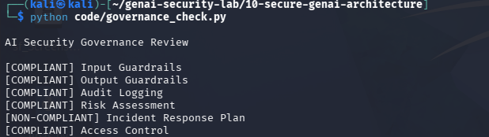

# Day 28 - AI Security Governance

## Objective

Evaluate AI systems against defined security requirements.

## Security Requirements

- Input Guardrails
- Output Guardrails
- Audit Logging
- Risk Assessment
- Incident Response Plan
- Access Control

## Example Finding

Incident Response Plan

Status:

NON-COMPLIANT

## Test Evidence

## Security Benefit

Governance ensures security controls are consistently applied across AI systems.

## Real World Impact

Used by:

- Security Architects
- AI Governance Teams
- Compliance Teams
- CISOs

Governance programs help standardize AI security practices.
