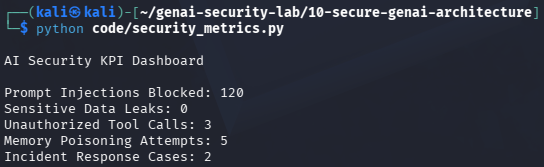

# Day 29 - AI Security Metrics & KPIs

## Objective

Measure the effectiveness of AI security controls.

## Example Metrics

- Prompt Injections Blocked
- Sensitive Data Leaks
- Unauthorized Tool Calls
- Memory Poisoning Attempts
- Incident Response Cases

## Test Evidence

## Security Benefit

Metrics provide visibility into security performance and help prioritize improvements.

## Real World Impact

Used by:

- CISOs
- Security Managers
- AI Security Teams
- Governance Programs

KPIs help organizations track the maturity of their AI security program.
