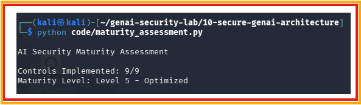

# Day 30 - AI Security Maturity Assessment

## Objective

Measure the maturity of an AI security program.

## Controls Evaluated

- Input Guardrails
- Output Guardrails
- RAG Security
- Agent Security
- Audit Logging
- Threat Hunting
- Incident Response
- Governance
- Metrics

## Example Result

Controls Implemented:

9/9

Maturity Level:

Level 5 - Optimized

## Test Evidence

## Security Benefit

Maturity assessments help organizations understand their AI security posture and identify areas for improvement.

## Real World Impact

Used by:

- CISOs
- Security Architects
- AI Governance Teams
- Enterprise Security Programs

Maturity assessments support strategic security planning.
