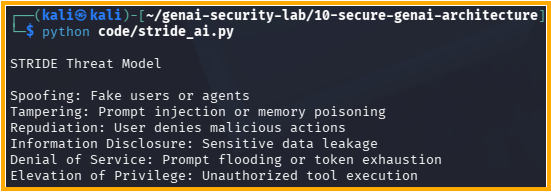

# Day 31 - STRIDE for AI Systems

## Objective

Apply STRIDE threat modeling to AI applications.

## STRIDE Categories

### Spoofing

Fake users or agents impersonating trusted entities.

### Tampering

Prompt injection, memory poisoning, and data modification.

### Repudiation

Users denying actions without audit evidence.

### Information Disclosure

Sensitive data leakage and unauthorized access.

### Denial of Service

Prompt flooding, token exhaustion, and agent loops.

### Elevation of Privilege

Unauthorized tool execution and privilege escalation.

## Security Benefit

STRIDE provides a structured framework for identifying AI security threats before deployment.

## Test Evidence

