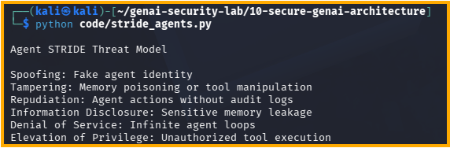

# Day 33 - STRIDE for AI Agents

## Objective

Apply STRIDE threat modeling to AI agents and MCP systems.

## STRIDE Analysis

### Spoofing

Fake agents impersonating trusted agents.

### Tampering

Memory poisoning, prompt injection, and tool manipulation.

### Repudiation

Agent actions without audit evidence.

### Information Disclosure

Sensitive memory or tool output leakage.

### Denial of Service

Infinite loops and excessive tool execution.

### Elevation of Privilege

Unauthorized tool execution and permission escalation.

## Security Benefit

STRIDE helps identify security risks in agent architectures before deployment.

## Test Evidence

