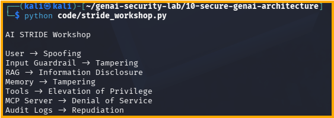

# Day 34 - STRIDE Workshop

## Objective

Perform a full STRIDE analysis of an AI system.

## Components Reviewed

- User
- Input Guardrail
- RAG
- Memory
- Tools
- MCP Server
- Audit Logs

## STRIDE Mapping

User -> Spoofing

Input Guardrail -> Tampering

RAG -> Information Disclosure

Memory -> Tampering

Tools -> Elevation of Privilege

MCP Server -> Denial of Service

Audit Logs -> Repudiation

## Test Evidence

## Security Benefit

Provides a structured methodology for identifying threats across AI architectures before deployment.
