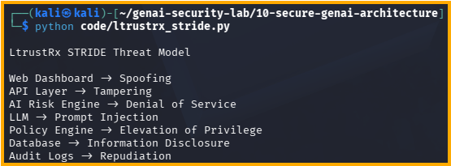

# Day 35 - LtrustRx STRIDE Threat Model

## Objective

Apply STRIDE threat modeling to the LtrustRx architecture.

## Components

- Web Dashboard
- API Layer
- AI Risk Engine
- LLM
- Policy Engine
- Database
- Audit Logs

## STRIDE Mapping

Web Dashboard -> Spoofing

API Layer -> Tampering

AI Risk Engine -> Denial of Service

LLM -> Prompt Injection

Policy Engine -> Elevation of Privilege

Database -> Information Disclosure

Audit Logs -> Repudiation

## Test Evidence

## Security Benefit

Provides a structured methodology for identifying risks before production deployment.

## Priority Risks

- Prompt Injection
- Data Leakage
- API Abuse
- Policy Bypass
- Agent Security
